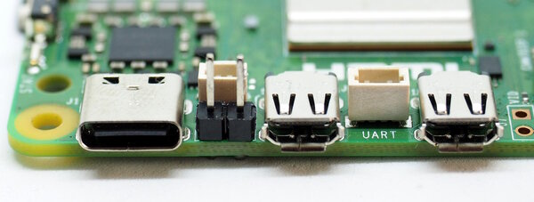
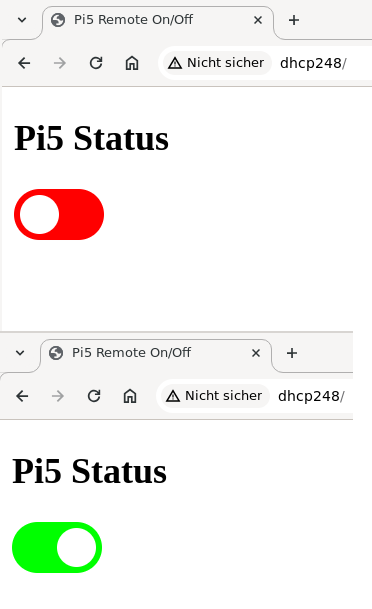

Remote Pi5 Power-Switch
=======================

This repository implements a remote Pi5 power-switch using a simple
CircuitPython WLAN-device. A Pico-W will do fine.

The Raspberry Pi 5 not only has a pushbutton that starts or stops the
device, but also an additional (unpopulated) header between the USB-C
plug and the first micro HDMI connector:

Note that you have to solder the headers you see in the image yourself.

Using this header, you can add an additional button, e.g. if the Pi5
is within a rack or a case. As an alternative, you can add a MCU to
control the Pi5 remotely.

This repository provides a simple implementation of a webserver
running on a CircuitPython device. The webservers serves a single page
with a slider that lets you toggle the state of the Pi5.

Wiring
------

You need three cables from the MCU to the Pi5:

  - **SIG**: MCU open-drain output GPIO connected to the pin next to the
    USB-C connector.
  - **GND**: MCU ground to the pin next to the micro HDMI connector.
  - **3V3**: MCU input GPIO to one of the 3V3 pins of the Pi5 (pin 1 or 17).
    Note that a series resistor of about 10K is recommended between the
    3V3-pin of the Pi5 and the MCU.

By toggling the SIG-pin the MCU simulates a press of the pushbutton and
changes the state of the Pi5. The 3V3-pin is not strictly necessary but
it is used to check the powered state of the Pi5. A powered Pi5 does not
imply it is up and running, but normally boot-times are short so controlling
the 3V3-pin is a valid shortcut.

Installation and Configuration
------------------------------

Copy `src/template_settings.py` to `src/settings.py` and adapt to your
needs.

Then copy all files below `src` to your CircuitPython device. The device
has to support WLAN.

The program uses the webserver from
<https://github.com/bablokb/circuitpython-ehttpserver>. If there is a
need to update the server, you can use circup.

If you have problems distinguishing red and green, then you can edit the
color-styles "pi5_on", "pi5_changing" and "pi5_off" within
`src/www/styles.css`.

Operation
---------

Depending on the configuration (`CONFIG['ap_mode']`) the webserver either
starts it's own access-point or joins the given network. Once started,
head to `http://<ip-of-the-server>/`. You will see the slider and can change
the state of the Pi5:

Changing the slider will start a timer that automatically updates the
intermediate ("orange"-colored) state. Otherwise, reloading the page
will also update the state.

Porting
-------

The code does not use anything specfic to CircuitPython, so porting to
a different language running on a different device will work just fine.
Even WLAN is not necessary, using RF (e.g. 433MHz) or IR will also work.
